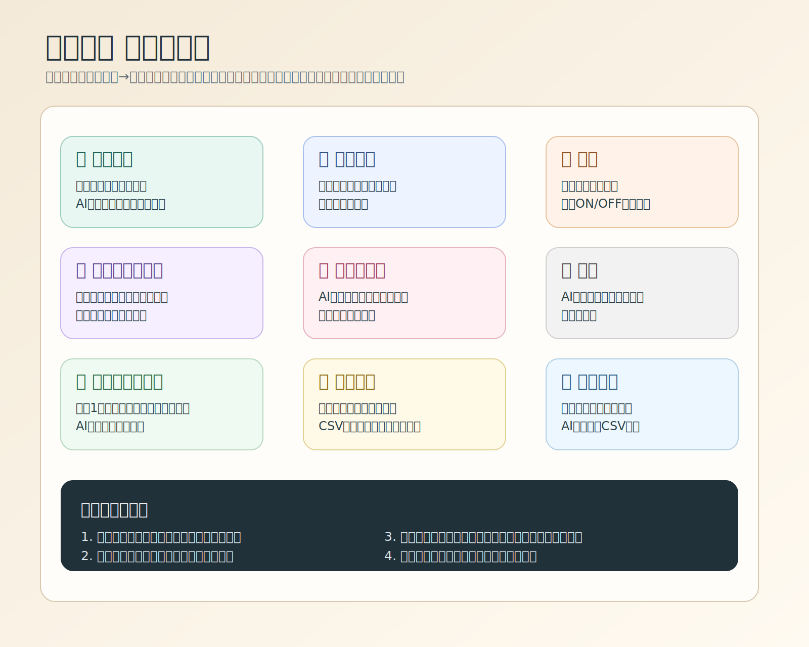

# 先生向け 初期設定手順

このアプリは、最初の1回だけ設定が必要です。  
設定が終われば、ふだんはスプレッドシートを開きっぱなしにしなくても使えます。

## 1. 最初にやること

1. 配布された登録ページを開く
2. 名前などを入れて送信する
3. 表示された `テンプレートシートを開く` を押す
4. 開いたテンプレートで `ファイル -> コピーを作成` を押す
5. コピーして作った `自分のシート` を開く
6. 画面上のメニューから `初期設定 -> このシートを使えるようにする` を押す
7. 通常はそのまま登録が完了します
8. もし登録IDの入力が出たときだけ、登録ページに表示された登録IDを入れる

## 2. 大事な注意

- 配布されたテンプレートは `見本` です。直接書き込まず、必ずコピーして使ってください
- 元テンプレートは `閲覧のみ` の状態で配られます
- 実際に使うのは、`自分がコピーして作ったシート` です

## 3. `このシートを使えるようにする` とは

これは、コピーしたシートをあなた専用のアプリとして登録する操作です。  
これをしないと、児童画面や先生画面が正しく動きません。

次のメッセージが出たら登録完了です。

- `登録が完了しました。管理側の反映を待ってください。`

## 4. 権限確認について

初回は次のような画面が出ることがあります。

- `Authorization required`
- `このアプリは Google で確認されていません`

これは、シートの保存や初期設定のために必要な確認です。

### 進め方

1. `権限を確認` を押す
2. 自分の Google アカウントを選ぶ
3. 警告が出たら `詳細` を押す
4. `無題のプロジェクト（安全ではないページ）に移動` を押す
5. `許可` を押す

この確認は通常、最初の1回だけです。

## 5. 最初の授業準備

導入が終わっただけでは、まだ児童は使えません。  
最初に次の2つをしてください。

1. `単元設定` タブで単元を作る
2. `授業状況` タブで授業を開始する

この2つが終わると、児童画面で入力できるようになります。

## 6. 名簿について

- 名簿が未設定でも、最初は `1〜40番` で動きます
- あとから `名簿` タブで名前を入れれば大丈夫です

## 7. ふだんの使い方

毎回スプレッドシートの中で作業する必要はありません。  
設定が終わったら、上のメニューから次を開いて使います。

- `じぶんまとめ -> 先生画面を開く`
- `じぶんまとめ -> 児童画面を開く`

## 8. 先生画面のタブ早見表

- `授業状況`
  いまの授業で、だれがどこまで書いて提出したかを見る画面です。授業開始、メダル発表、児童への一括フィードバックもここで行います。
- `単元設定`
  新しい単元を作る画面です。単元名、教科、時間数、児童に書かせる項目を設定します。
- `名簿`
  出席番号と名前、在籍の有無を整える画面です。あとからでも編集できます。
- `教科デフォルト`
  算数や国語など、教科ごとの「いつもの記入項目」を決める画面です。ここで作った内容は、新しい単元に引き継がれます。
- `プロンプト`
  AIコメント、AI所見、AI仮評定、メダル人数などの設定を変える画面です。通常運用では毎回触る必要はありません。
- `ログ`
  AIがうまく動かないときに確認する保守用の画面です。通常は必要なときだけ開けば十分です。
- `ポートフォリオ`
  児童1人分の記録をまとめて見る画面です。単元をまたいで確認したり、AI所見の下書きを作ったりできます。
- `単元記録`
  1つの単元や教科の記録をクラス全体で見返す画面です。CSV出力や、AIによる単元指導レポート生成もできます。
- `評定する`
  観点ごとに評定を入力する画面です。根拠を見ながら入力でき、空欄にはAI仮評定も出せます。

### 最初によく使う順番

1. `単元設定` で単元を作る
2. `授業状況` で授業を開始する
3. 必要なら `名簿` を整える
4. 授業後に `単元記録` や `ポートフォリオ` を見る
5. 学期末などに `評定する` を使う

## 9. アプリのように使う方法

### パソコン Chrome の場合

1. `先生画面を開く` を押す
2. 開いたページで、アドレスバー右側の `インストール` または `PCに保存` を押す
3. 追加すると、デスクトップアプリのように開けます

### iPad / iPhone の場合

1. `先生画面を開く` を Safari で開く
2. 共有ボタンを押す
3. `ホーム画面に追加` を押す

### Android の場合

1. `先生画面を開く` を Chrome で開く
2. 右上メニューを押す
3. `ホーム画面に追加` または `アプリをインストール` を押す

## 10. スクリーンショットを入れる場所

次の画面の写真があると、初回導入がかなり分かりやすくなります。

1. `ファイル -> コピーを作成`
2. `初期設定 -> このシートを使えるようにする`
3. `このアプリは Google で確認されていません`
4. `じぶんまとめ -> 先生画面を開く`
5. `先生画面のタブ早見表` でよく使う `授業状況` と `単元設定`

## 11. うまくいかないとき

- 権限確認が出たら、許可してからもう一度試してください
- コピー元のシートではなく、`コピーして作った自分のシート` を開いてください
- メニューに `初期設定` が見えないときは、シートを再読み込みしてください
- 単元を作っていないと児童画面は進みません
- それでもだめなときは、先生名と登録IDを管理者へ伝えてください
